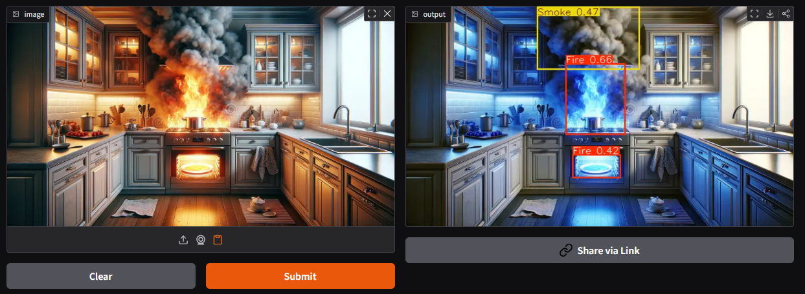

# 🔥 Live Fire & Smoke Detection using YOLOv8


## 🎥 Demo Video

  [](demo.mp4)

<p align="center">
  <video width="700" controls>
    <source src="demo.mp4" type="video/mp4">
  </video>
</p>

## 📌 Project Overview

This project is a **real-time fire and smoke detection system** powered by a YOLOv8 deep learning model. It utilizes a webcam feed to perform **frame-by-frame object detection** and visually highlights detected fire or smoke regions.

The system is deployed using **Gradio**, allowing users to access the application through a web interface, including support for **live webcam streaming** in the browser.

---

## 🎯 Objectives

* Detect fire and smoke in real time using a trained YOLOv8 model
* Provide a simple and interactive web-based interface
* Enable deployment on cloud platforms such as Hugging Face Spaces
* Demonstrate AI-based hazard detection without hardware dependencies

---

## ⚙️ Technologies Used

* Python
* Ultralytics YOLOv8
* OpenCV
* Gradio
* NumPy

---

## 📁 Project Structure

```
fire-smoke-detection/
│
├── app.py
├── requirements.txt
├── best_nano_111.pt
└── README.md
```

---

## 🚀 Installation & Setup

### 1. Clone the Repository

```
git clone https://github.com/edcelnobs/fire-smoke-detection.git
cd fire-smoke-detection
```

### 2. Install Dependencies

```
pip install -r requirements.txt
```

### 3. Run the Application

```
python app.py
```

---

## 📦 Requirements

```
ultralytics
opencv-python-headless
gradio
numpy
torch
```

---

## 🧠 How It Works

1. The webcam captures live frames through the browser
2. Each frame is processed using the YOLOv8 model
3. The model detects fire or smoke based on trained features
4. Detected objects are highlighted with bounding boxes
5. The annotated frame is displayed in real time

---

## 🎥 Features

* 🔴 Real-time webcam detection
* 🔍 YOLOv8-based object detection
* 🖥️ Web interface using Gradio
* ☁️ Cloud deployment ready (Hugging Face Spaces)
* ⚡ Lightweight model for faster inference

---

## ⚠️ Limitations

* Frame rate depends on internet speed and server performance
* Not suitable for high-FPS real-time systems
* Requires a trained YOLOv8 model (`.pt` file)
* Webcam access depends on browser permissions

---

## 📌 Deployment (Hugging Face Spaces)

1. Create a new Space (Gradio SDK)
2. Upload:

   * `app.py`
   * `requirements.txt`
   * model file or model URL
3. Wait for automatic build and deployment

---

## 📷 Usage

* Open the deployed app in a browser
* Allow webcam access
* Start live detection
* Observe bounding boxes for fire/smoke detection

---

## 🔥 Future Improvements

* Add confidence score display
* Support video upload detection
* Integrate Firebase for real-time logging
* Optimize model for faster inference (YOLOv8 Nano/Tiny)
* Add alert system (sound/email notification)

---

## 👨‍💻 Author

Developed as part of an academic project on **AI-based fire detection and IoT systems**.

---

## 📄 License

This project is for educational and research purposes.
